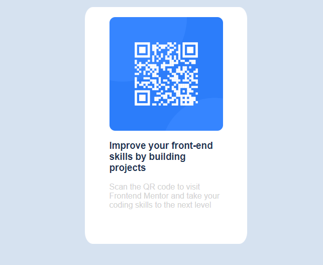

# Frontend Mentor - QR code component solution

This is a solution to the [QR code component challenge on Frontend Mentor](https://www.frontendmentor.io/challenges/qr-code-component-iux_sIO_H). Frontend Mentor challenges help you improve your coding skills by building realistic projects. 

## Table of contents

- [Overview](#overview)
  - [Screenshot](#screenshot)
  - [Links](#links)
- [My process](#my-process)
  - [Built with](#built-with)
  - [What I learned](#what-i-learned)
  - [Continued development](#continued-development)
  - [Useful resources](#useful-resources)
- [Author](#author)
- [Acknowledgments](#acknowledgments)

**Note: Delete this note and update the table of contents based on what sections you keep.**

## Overview

### Screenshot



### Links

- Solution URL: [Add solution URL here](https://your-solution-url.com)
- Live Site URL: [Add live site URL here](https://your-live-site-url.com)

## My process

### Built with

- Semantic HTML5 markup
- CSS custom properties
- Mobile-first workflow
- scss


### What I learned

Used the css-preprocesser to style the project.

I used the feature of creating variables. and the nesting feature of the css-preprocesser

```scss

  $backGroundColor: hsl(212, 45%, 89%);
  $White: hsl(0,0,100%);
  $lightGray: hsl(212, 45%, 89%);
```
```scss
.textSection {
    width: 226px;
    height: 226px;
    h3 {
        font-family: 700;
        color: hsl(218, 44%, 22%);
    }
    color: lightgray;
}
```


## Author

- Website - [Bonke Gcobo](https://bonkegcobo.github.io/Portfolio/)
- Frontend Mentor - [Bonke](https://www.frontendmentor.io/profile/BonkeGcobo)

**Note: Delete this note and add/remove/edit lines above based on what links you'd like to share.**

## Acknowledgments

Design Belongs to @FrontendMentor

